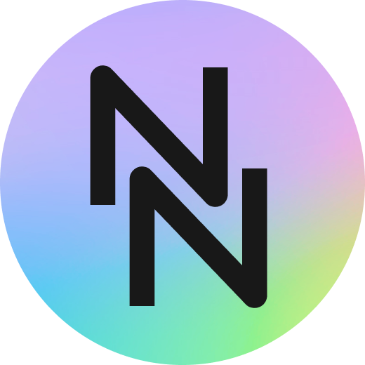
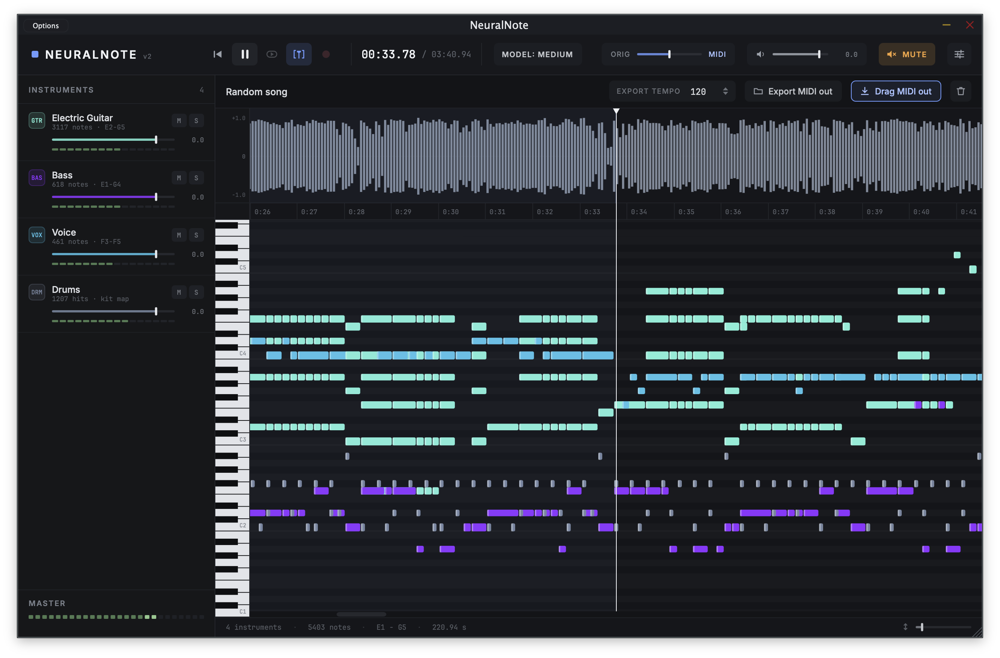

# NeuralNote 

NeuralNote is the audio plugin that brings **state-of-the-art audio-to-MIDI transcription** into your favorite Digital
Audio Workstation.

> [!WARNING]
> 🚧 **NeuralNote v2 is a work in progress.**
>
> - There are no installers or prebuilt binaries yet. You need to [build it from source](#build-from-source). Please
>   share your feedback in [GitHub issues](https://github.com/DamRsn/NeuralNote/issues)!
> - Only macOS and Windows are supported for now. Linux support is coming soon.
> - Testing so far covers only a few machines and GPUs. If something breaks or runs slowly on your hardware, please
>   report it (see [Hardware](#models-and-performance)).

## What's new in v2

- **A new, much more capable transcription model.** v2 replaces Spotify's Basic Pitch with
  [MuScriptor](https://github.com/muscriptor/muscriptor), from Kyutai and Mirelo
  ([paper](https://arxiv.org/abs/2607.08168v1), [blog post](https://kyutai.org/blog/2026-07-10-muscriptor/),
  [checkpoints](https://huggingface.co/MuScriptor)). It is a transformer with 103M to 1.4B parameters, compared with
  fewer than 17K for Basic Pitch.
- **Multi-instrument transcription.** Transcribe full mixes, not just one instrument at a time, with notes
  grouped by instrument.
- **Still fully local.** Transcription runs on your machine, and your audio never leaves it. NeuralNote only goes
  online to download models and to check for updates.



## Usage

NeuralNote is a simple AudioFX plugin (VST3/AU/Standalone app) that you apply to the track you want to transcribe.

- Gather some audio:
  - Click record. This works both when recording live and when playing the track in your DAW.
  - Or drop an audio file on the plugin (.wav, .aiff, .flac, .mp3 and .ogg (vorbis) are supported).
- Select the instruments to transcribe in the left panel, or select `Automatic` to let the model detect them.
  - Transcriptions tend to be better when the model is given the correct set of instruments.
- Click `Transcribe`. The transcription runs in the background, and the MIDI fills into the piano roll as it is
  decoded. A progress indicator and a cancel button are shown while it runs.
- Click play to listen to the result without waiting for the transcription to finish. Only the part decoded so far
  plays.
  - Adjust the mix between the source audio and the synthesized transcription.
  - Adjust the level of each instrument.
- When you're happy with the result, drag and drop the MIDI from the plugin onto a MIDI track, or save the MIDI file
  to your computer.

## Models and performance

MuScriptor comes in three sizes, `small`, `medium` and `large`, which trade speed for quality. NeuralNote downloads
them as GGUF files from [`DamRsn/muscriptor-gguf`](https://huggingface.co/DamRsn/muscriptor-gguf) on Hugging Face.
When no model is installed, all three sizes are available to download. The Model button in the top bar lets you
switch between installed models, download other sizes, and open the folder where they are stored.

| OS      | Models folder                 |
| ------- | ----------------------------- |
| macOS   | `~/Library/NeuralNote/models` |
| Windows | `%APPDATA%\NeuralNote\models` |

You can also put a model file in that folder by hand. Use a file from `v1/` of the
[HF repo](https://huggingface.co/DamRsn/muscriptor-gguf), unchanged and with its original name (e.g.
`muscriptor-medium-f16.gguf`). NeuralNote only picks up files whose name and size match the ones it downloads.

You can remove a model by deleting it from this folder, and re-download it at any time.

**Hardware.** Transcription speed depends mostly on the model size and on your hardware. The GPU is used when
available, through Metal on macOS and Vulkan on Windows. A GPU is strongly recommended for the `medium` and `large`
models. Only a few GPUs have been tested so far. If transcription fails, gives wrong results or is unexpectedly slow on
your machine, please open an issue, either [here](https://github.com/DamRsn/NeuralNote/issues) or in
[muscriptor.cpp](https://github.com/DamRsn/muscriptor.cpp/issues) if the problem is in the engine itself. Please
include your OS, GPU and model size.

Approximate real-time factors measured on an Apple M1 Pro (above 1× means faster than real time):

| Size     | GPU (Metal) | CPU             |
| -------- | ----------- | --------------- |
| `small`  | ~3.5×       | ~2×             |
| `medium` | ~1.5×       | ~0.7×           |
| `large`  | ~0.5×       | not recommended |

See [muscriptor.cpp's performance notes](https://github.com/DamRsn/muscriptor.cpp/blob/main/docs/PERFORMANCE.md) for
details.

## Build from source

Requirements:

- `git`
- [CMake](https://cmake.org/)
- A C++23 compiler, such as Clang, MSVC or GCC. Only Clang has been tested so far, on macOS and Windows.
- Python 3 (used at configure time to fetch the synth's soundfont)
- Internet access on the first configure. `muscriptor.cpp` fetches [ggml](https://github.com/ggml-org/ggml), and the
  soundfont (~38 MB) is downloaded.

**Windows GPU support** needs the [Vulkan SDK](https://vulkan.lunarg.com/sdk/home) at build time. Without it,
NeuralNote builds and transcribes on the CPU only. With it, configure from a Visual Studio developer prompt, or set
`CC`, `CXX` and `RC` in the environment: ggml builds its shader generator as a separate project that doesn't see
CMake's compiler settings.

[Ninja](https://ninja-build.org/) is optional but makes builds faster (`-G Ninja`).

Clone with submodules:

```
git clone --recurse-submodules https://github.com/DamRsn/NeuralNote
cd NeuralNote
```

If you already cloned without them, run `git submodule update --init --recursive`.

Configure and build:

```
cmake -B build -DCMAKE_BUILD_TYPE=Release
cmake --build build --config Release
```

The Standalone app and the plugins are written to `build/NeuralNote_artefacts/Release/`.

## Reuse NeuralNote's transcription engine

The transcription engine is a separate, self-contained repo:
[muscriptor.cpp](https://github.com/DamRsn/muscriptor.cpp). It is a C++/ggml port of MuScriptor, included here as a
git submodule (`ThirdParty/muscriptor.cpp`) and linked as a static library. It takes 16 kHz mono float32 audio and
returns note events. See its [`docs/API.md`](https://github.com/DamRsn/muscriptor.cpp/blob/main/docs/API.md) for the
public API. The GGUF weights it loads are available on
[Hugging Face](https://huggingface.co/DamRsn/muscriptor-gguf) (see [License](#license)).

## Roadmap

- Linux support
- MIDI out, with per-instrument channel selection
- Installers and prebuilt binaries
- CLI
- Performance optimizations

## Bug reports, feature requests and contributing

If you find a bug or have a suggestion, please file a [GitHub issue](https://github.com/DamRsn/NeuralNote/issues).
Contributions are most welcome. Feel free to open a PR!

## License

NeuralNote's code is published under the **Apache-2.0** license. See the [license file](LICENSE).

**The MuScriptor model weights are not open source.** They were released by Kyutai and Mirelo under the
[CC BY-NC 4.0](https://creativecommons.org/licenses/by-nc/4.0/) license, and are redistributed as GGUF files on
[Hugging Face](https://huggingface.co/DamRsn/muscriptor-gguf) under that same license. They may only be used
non-commercially. The Apache-2.0 license covers NeuralNote's code only, not the weights.

#### Third-party libraries and assets

Their full license notices are in [`Installers/license.txt`](Installers/license.txt).

- [JUCE](https://juce.com/) (JUCE Starter)
- [muscriptor.cpp](https://github.com/DamRsn/muscriptor.cpp) (MIT license)
- [ggml](https://github.com/ggml-org/ggml) (MIT license, fetched by muscriptor.cpp)
- [PFFFT](https://bitbucket.org/jpommier/pffft) (BSD-style license, bundled in muscriptor.cpp)
- [MuScriptor](https://github.com/muscriptor/muscriptor) model weights (CC BY-NC 4.0, see above)
- [TinySoundFont](https://github.com/schellingb/TinySoundFont) (MIT license)
- [MuseScore_General](https://ftp.osuosl.org/pub/musescore/soundfont/MuseScore_General/) soundfont (MIT license)
- [minimp3](https://github.com/lieff/minimp3) (CC0-1.0 license)
- [Inter](https://github.com/rsms/inter) (SIL Open Font License 1.1)
- [JetBrains Mono](https://github.com/JetBrains/JetBrainsMono) (SIL Open Font License 1.1)

## Credits

#### NeuralNote v2

Developed by [Damien Ronssin](https://github.com/DamRsn), with AI assistance.

#### NeuralNote v1

Developed by [Damien Ronssin](https://github.com/DamRsn) and [Tibor Vass](https://github.com/tiborvass). The plugin
user interface was designed by Perrine Morel.

Many thanks to the v1 contributors!

- [jatinchowdhury18](https://github.com/jatinchowdhury18): File browser.
- [trirpi](https://github.com/trirpi)
  - More scale options in `SCALE QUANTIZE`.
  - Horizontal zoom for the audio waveform and the piano roll.
- [polygon](https://github.com/polygon) and [SamuMazzi](https://github.com/SamuMazzi): Linux support.
