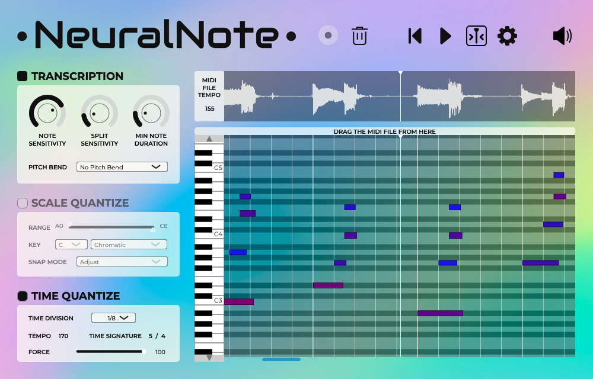

# NeuralNote 

NeuralNote is the audio plugin that brings **state-of-the-art Audio to MIDI conversion** into
your favorite Digital Audio Workstation.

- Works with any tonal instrument (voice included)
- Supports polyphonic transcription
- Supports pitch bend detection
- Lightweight and very fast transcription
- Allows to adjust the parameters while listening to the transcription
- Allows to scale and time quantize transcribed MIDI directly in the plugin

## Install NeuralNote

Download the latest release for your platform [here](https://github.com/DamRsn/NeuralNote/releases) (Windows and macOS (
Universal) supported)!

Installers are available for both Windows and Mac, including Standalone, VST3, and AU (Mac only) versions. The
installers allow users to select which format(s) they want to install. On macOS, the code is signed, while on Windows,
it is not. This means you may need to take a few additional steps to use NeuralNote on Windows.

## Usage



NeuralNote comes as a simple AudioFX plugin (VST3/AU/Standalone app) to be applied on the track to transcribe.

The workflow is very simple:

- Gather some audio
    - Click record. Works when recording for real or when playing the track in a DAW.
    - Or drop an audio file on the plugin. (.wav, .aiff, .flac, .mp3 and .ogg (vorbis) supported)
- The MIDI transcription instantly appears in the piano roll section.
- Listen to the result by clicking the play button.
    - Play with the different settings to adjust the transcription, even while listening to it
    - Individually adjust the level of the source audio and of the synthesized transcription
- Once you're satisfied, export the MIDI transcription with a simple drag and drop from the plugin to a MIDI track.

**Watch our presentation video for the Neural Audio Plugin
competition [here](https://www.youtube.com/watch?v=6_MC0_aG_DQ)**.

NeuralNote uses internally the model from Spotify's [basic-pitch](https://github.com/spotify/basic-pitch). See
their [blogpost](https://engineering.atspotify.com/2022/06/meet-basic-pitch/)
and [paper](https://arxiv.org/abs/2203.09893) for more information. In NeuralNote, basic-pitch is run
using [RTNeural](https://github.com/jatinchowdhury18/RTNeural) for the CNN part
and [ONNXRuntime](https://github.com/microsoft/onnxruntime) for the feature part (Constant-Q transform calculation +
Harmonic Stacking).
As part of this project, [we contributed to RTNeural](https://github.com/jatinchowdhury18/RTNeural/pull/89) to add 2D
convolution support.

## Build from source

Requirements are: `git`, `cmake`, and your OS's preferred compiler suite.

Use this when cloning:

```
git clone --recurse-submodules --shallow-submodules https://github.com/DamRsn/NeuralNote
 ```

The following OS-specific build scripts have to be executed at least once before being able to use the project as a
normal CMake project. The script downloads onnxruntime static library (that we created
with [ort-builder](https://github.com/olilarkin/ort-builder)) before calling CMake.

#### macOS

```
$ ./build.sh
```

#### Windows

Due to [a known issue](https://github.com/DamRsn/NeuralNote/issues/21), if you're not using Visual Studio 2022 (MSVC
version: 19.35.x, check `cl` output), then you'll need to manually build onnxruntime.lib like so:

1. Ensure you have Python installed; if not, download at https://www.python.org/downloads/windows/ (this does not
   currently work with Python 3.11, prefer Python 3.10).

2. Execute each of the following lines in a command prompt:

```
git clone --depth 1 --recurse-submodules --shallow-submodules https://github.com/tiborvass/libonnxruntime-neuralnote ThirdParty\onnxruntime
cd ThirdParty\onnxruntime
python3 -m venv venv
.\venv\Scripts\activate.bat
pip install -r requirements.txt
.\convert-model-to-ort.bat model.onnx
.\build-win.bat model.required_operators_and_types.with_runtime_opt.config
copy model.with_runtime_opt.ort ..\..\Lib\ModelData\features_model.ort
cd ..\..
```

Now you can get back to building NeuralNote as follows:

```
> .\build.bat
```

#### IDEs

Once the build script has been executed at least once, you can load this project in your favorite IDE
(CLion/Visual Studio/VSCode/etc) and click 'build' for one of the targets.

## Reuse code from NeuralNote’s transcription engine

All the code to perform the transcription is in `Lib/Model` and all the model weights are in `Lib/ModelData/`. Feel free
to use only this part of the code in your own project! We'll try to isolate it more from the rest of the repo in the
future and make it a library.

The code to generate the files in `Lib/ModelData/` is not currently available as it required a lot of manual operations.
But here's a description of the process we followed to create those files:

- `features_model.onnx` was generated by converting a keras model containing only the CQT + Harmonic Stacking part of
  the full basic-pitch graph using `tf2onnx` (with manually added weights for batch normalization).
- the `.json` files containing the weights of the basic-pitch cnn were generated from the tensorflow-js model available
  in the [basic-pitch-ts repository](https://github.com/spotify/basic-pitch-ts), then converted to onnx with `tf2onnx`.
  Finally, the weights were gathered manually to `.npy` thanks to [Netron](https://netron.app/) and finally applied to a
  split keras model created with [basic-pitch](https://github.com/spotify/basic-pitch) code.

The original basic-pitch CNN was split in 4 sequential models wired together, so they can be run with RTNeural.

## Roadmap

- Improve stability
- UX improvements (zoom in/out, play/pause with spacebar, etc.)
- Add tooltips
- Make internal synth support pitch bends
- Linux support

## Bug reports and feature requests

If you have any request/suggestion concerning the plugin or encounter a bug, please file a GitHub issue.

## Contributing

Contributions are most welcome! If you want to add some features to the plugin or simply improve the documentation,
please open a PR!

## License

NeuralNote software and code is published under the Apache-2.0 license. See the [license file](LICENSE).

#### Third Party libraries used and license

Here's a list of all the third party libraries used in NeuralNote and the license under which they are used.

- [JUCE](https://juce.com/) (JUCE Starter)
- [RTNeural](https://github.com/jatinchowdhury18/RTNeural) (BSD-3-Clause license)
- [ONNXRuntime](https://github.com/microsoft/onnxruntime) (MIT License)
- [ort-builder](https://github.com/olilarkin/ort-builder) (MIT License)
- [basic-pitch](https://github.com/spotify/basic-pitch) (Apache-2.0 license)
- [basic-pitch-ts](https://github.com/spotify/basic-pitch-ts) (Apache-2.0 license)
- [minimp3](https://github.com/lieff/minimp3) (CC0-1.0 license)

## Could NeuralNote transcribe audio in real-time?

Unfortunately no and this for a few reasons:

- Basic Pitch uses the Constant-Q transform (CQT) as input feature. The CQT requires really long audio chunks (> 1s) to
  get amplitudes for the lowest frequency bins. This makes the latency too high to have real-time transcription.
- The basic pitch CNN has an additional latency of approximately 120ms.
- The note events creation algorithm processes the posteriorgrams backward (from future to past) and is hence
  non-causal.

But if you have ideas please share!

## Credits

NeuralNote was developed by [Damien Ronssin](https://github.com/DamRsn) and [Tibor Vass](https://github.com/tiborvass).
The plugin user interface was designed by Perrine Morel.

#### Contributors

Many thanks to the contributors!

- [jatinchowdhury18](https://github.com/jatinchowdhury18): File browser.
- [trirpi](https://github.com/trirpi)
    - More scale options in `SCALE QUANTIZE`.
    - Horizontal zoom for the audio waveform and the piano roll.
